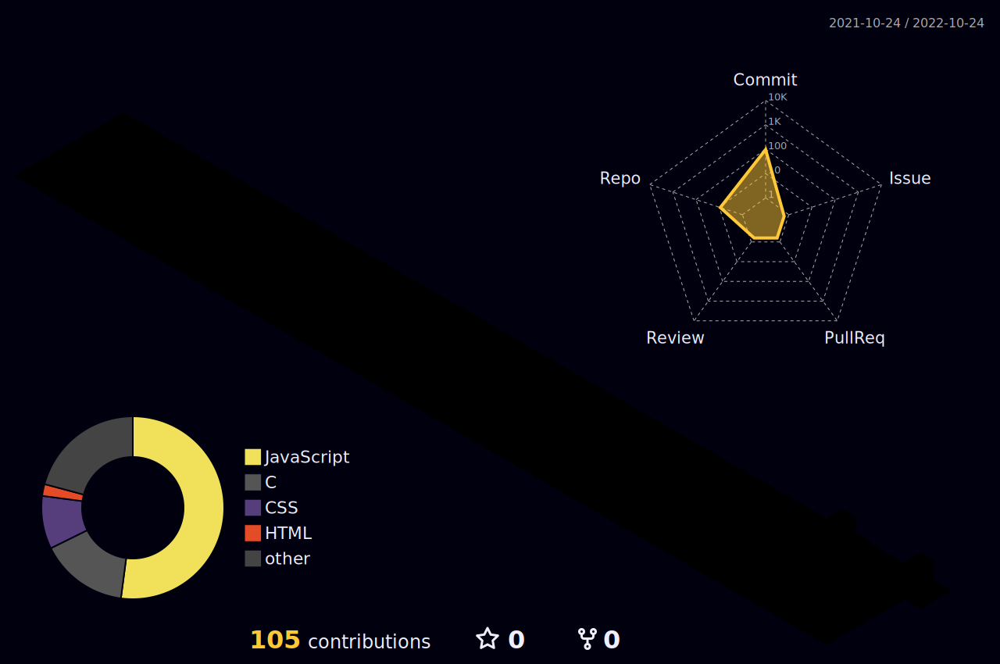

<!--  -->
<h1 align="center">Hi 👋, I'm Animesh Maiti</h1>

<h3 align="center">A passionate frontend developer from India</h3>

  

- 💬 Ask me about **React,DSA(c)**

- 📫 How to reach me **maitianimesh08@gmail.com**

- ⚡ Fun fact **I am a failure**

- 👨‍💻 All of my projects are available at [https://animeshmaiti.github.io/AnimeshProfile/](https://animeshmaiti.github.io/AnimeshProfile/)

<h3 align="left">Connect with me:</h3>

<h3 align="left">Languages and Tools:</h3>

          

&nbsp;

